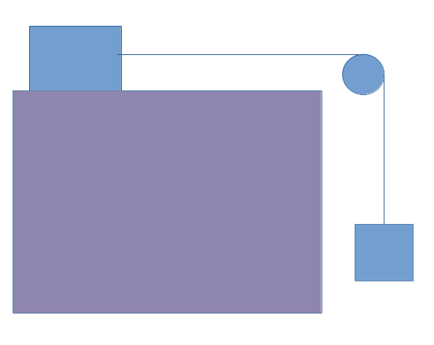

# Fizik Final Notlari

## 6) DINAMIK

Dinamik konusunda her sey " F = m * a " formulu ile cozulur.

Kuvvet birimi (F), kg(m) * m/(s^2)(a)
                   uzerinden
                   (kg * m)/(s^2) olur.

Bazen birim degisimleri gerekebilir. Kutle kilogram, ivme ise metre bolu saniye karedir.

Bu tur bir problemde sunlar yapilir:
1. Serbest cisim diyagrami cizilir.
2. Ip sayesinde ivmeler ve iplerin uyguladigi kuvvetler aynidir, buna gore bir denklem kurulur.
3. Denklem cozulup ip kuvveti ve ivme bulunur.

1- Serbest cisim diyagrami cizilir.

2- Ip sayesinde ivmeler ve iplerin uyguladigi kuvvetler aynidir, buna gore bir denklem kurulur.

Ilk S.C.D icin Fnet soyledir.

T = 3kg * a

Ikinci S.C.D icin Fnet soyledir.

G - T = 7kg * a

G = T + 7kg * a

G = T(3kg * a) + 7kg * a

G = 10kg * a

3- Denklem cozulup ip kuvveti ve ivme bulunur.

G / 10kg = a

## 6-2 Dairesel Harekette Merkezcil Kuvvet

F = m * aN

aN = V^2 / R

F = (m * V^2)/ R

