# Yapilari Tanimlama ve Siniflandirma

Yapi Gereci -> Yapi Bileseni -> Yapi Elemani -> Yapi
Malzemeler  -> Tugla/Seramik -> Tugla Duvar  -> Yapi

## YAPI
### Tanim
Yapi ***ihtiyaclari*** karsilamak uzere **malzeme** ve **yapim yontemleri** kullanilarak; *karada*, *suda*, *yer altinda*, *yer ustunde*, *gecici* veya *kalici* yapilan her turlu tesis ve eklerdir.
### Siniflandirma
- Mulkiyetleri(sahiplikler- bakimindan
    1. Gercek veya tuzel(sirke- kisilere ait yapilar
    2. Vakiflara ait
    3. Resmi(kam- yapilari
- Zemin seviyesine gore
    1. Alt yapilar(depolar, siginakla)
    2. Ust yapilar
- Surekliliklerine gore
    1. Gecici yapilar
    2. Kalici yapilar
- Yapilis amaclari bakimindan
    1. Bina yapilari
    2. Anitlar ve tarihi yapilar
    3. Ulastirma yapilari(Tunel, kopru, viyaduk)
    4. Spor tesisleri
    5. Su yapilari(su icinde ya da su kenarind)
## Bina Yapilari

### Tanim
Dis etkenlerden korunmak icin yapilan yapidir.

### Siniflandirilmasi
- Amaclari bakimindan
    1. Meskenler
    2. Konklm(otel, motel, kmp-
    3. Kultur ve egitim(kutuphne, muze-
    4. Sglik binlri(hstne, sglik ocgi-
    5. Dini binlr(cmiler, mescitler, kiliseler-
    6. Sosyl Fliyet(sinem, tiytro, oper-
    7. Guvenlik binlri(hpishne, sigink, krkol, dliye binsi-
    8. Ticret binlri(mrketler, is hnlri, crsilr, bnklr-
    9. Endustri binlri(tolyeler, imlthneeler, fbriklr-

- Tasiyici elemanlari bakimindan
    1. Iskelet-Karkas binalar**
       - Celik, ahsap iskeletli binalardir.
       - **KOLON** ve **KIRIS** yukleri **TEMELE** iletir.
       - Betonarme, celik, ahsap karkas binalar yapilabilir.
    2. Yigma yapilar
       - Bina yuku **DUVARLAR** tarafindan tasinir.
       - **TAS** ve **KERPIC**'ten yapilabilir.
    3. Karma yapilar
        - Bir bolumu yigma, bir bolumu karkas olarak insta edilmis yapilardir.

- Yapimlarinda kullanilan teknik bakimindan
    1. Geleneksel yontemlerle yapilan binalar
    2. Prefabrik binalar
    3. Karma binalar

- Tasiyici elemanlarinin insasinda kullanilan malzeme bakimindan
    1. Kagir yapilar(yigma yapilar-
    2. Betonarme yapilar(betonarme karkas-
    3. Celik yapilar
    4. Ahsap yapilar
    5. Karma yapilar(betonarme binada celik sundurm-
### Binalari Olusturan Ana Bolumler
- Tasiyici elemanlar
    1. Temeller
    2. Duvarlar(Yigma yapilar icin-
    3. Kolonlar(Sutunlar-
    4. Kirisler
    5. Dosemeler(Yapiyi katlara ayiran elemanlar-
    6. Merdivenler
    7. Catilar

- Tamamlayici elemanlar
    1. Bacalar
    2. Dogramalar
    3. Doseme, duvar, tavan kaplamalari
    4. Sivalar
    5. Boyalar
    6. Yalitim

- Tesisatlar(Donanimlar)
    1. Temiz ve pis su tesisati
    2. Elektrik tesisati
    3. Isitma tesisati
    4. Iklimlendirme-klima tesisati(isitma, sogutma, temizleme-
    5. Havalandirma
    6. Guvenlik tesisati
    7. Haberlesme tesisati
    8. Kanalizasyon tesisati
    9. Yildirim(paratoner- tesisati
    10. Dogalgaz
    11. Akustik-ses vs.

## APLIKASYON

### Tanim
Yapinin arazi ya da arsa uzerindeki yerinin belirlenmesi islemidir.
ARAZI, ARSA, IMAR PLANI, PARSEL, IMAR DURUM BELGESI(IMAR CAPI)

### Aplikasyon Islem Sirasi
1. Parsel sinirlari belirlenir.
Parsel sinirlarini belirlemek icin aplikasyon krokisinden yararlanilir. Ayrica bu asamada Tapu Kadastro Idaresinden yardim istenmelidir.

Aplikasyon Krokisi
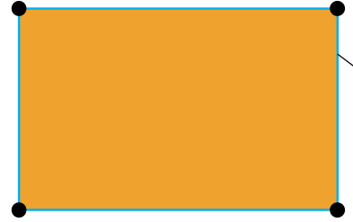
Parsel kose noktalarinin (kordinatlarin) tanimlandigi belgedir. Tapu Kadastro'dan alinir.

2. Yapi sinirlari belirlenir
Imar durum belgesi ve mimari projedeki durum planindan yararlanilarak, yapinin parsel icerisindeki yeri belirlenir.
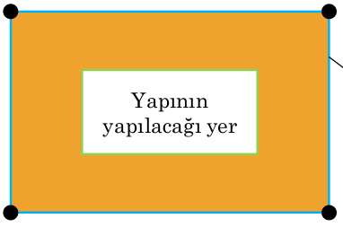

3. Kazi sinirlari belirlenir
En az 50 cm, kazi guvenligi, zemin yapisi, kazi derinligi dikkate alinir.

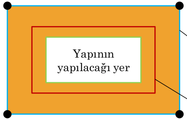

4. Ip iskelesi(telora) sinirlari belirlenir
Kazi yapildiktan sonra kaybolan sinirlari referanslandirir.
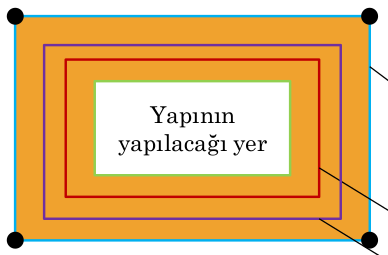

5. Ip iskelesi teskil edilir
Kaziklar cakilir, ip gerili cekul(sakul) indirilir ve yerler belirlenir.
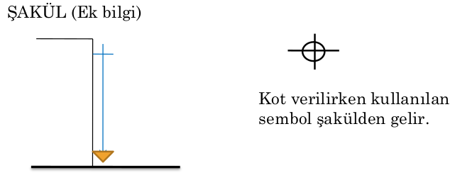

ORNEKLER:

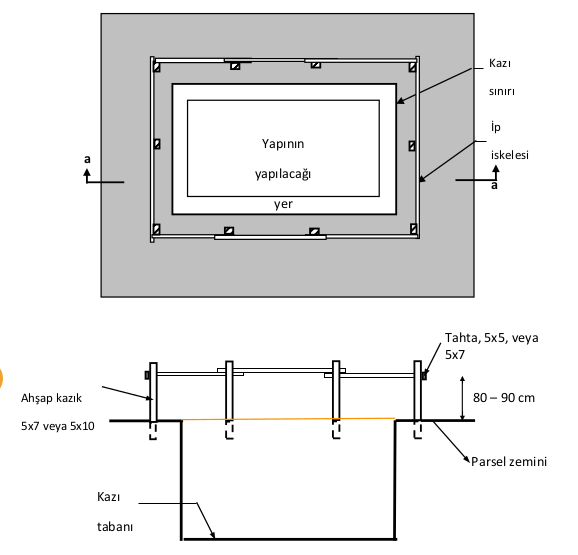
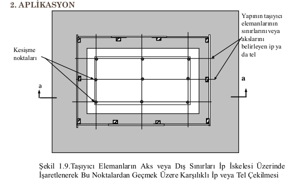
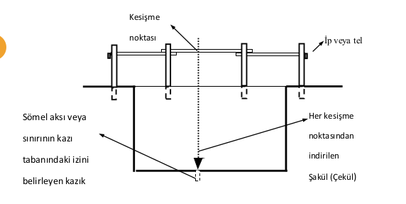
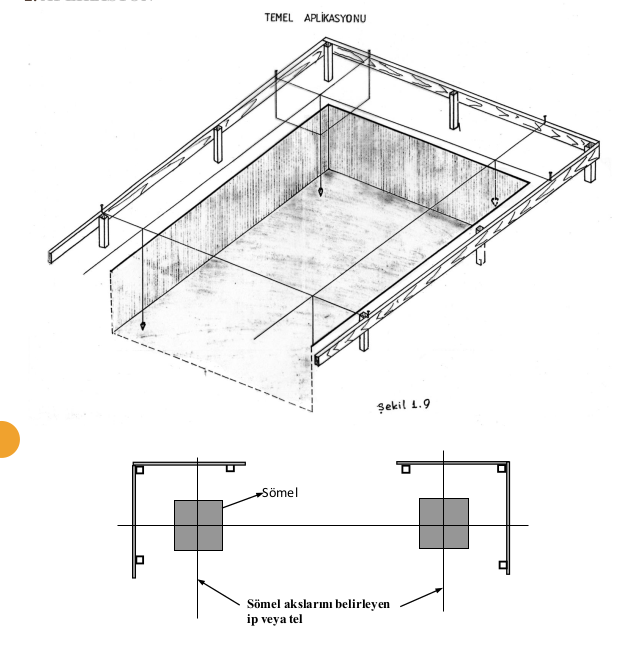
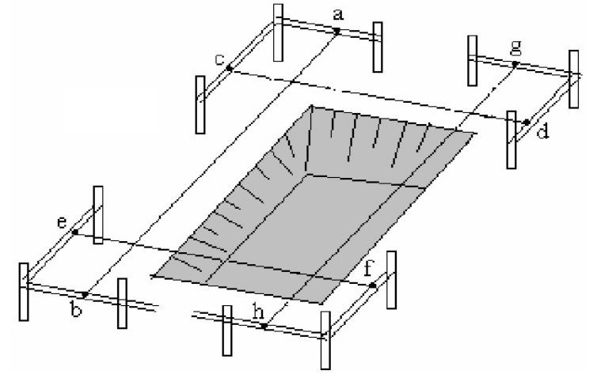
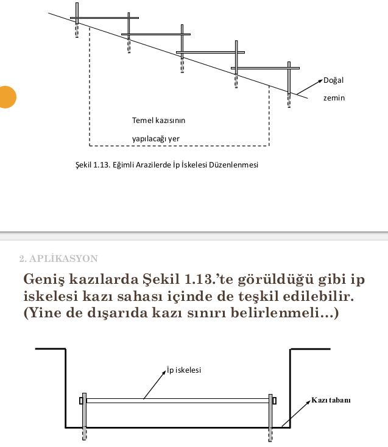
